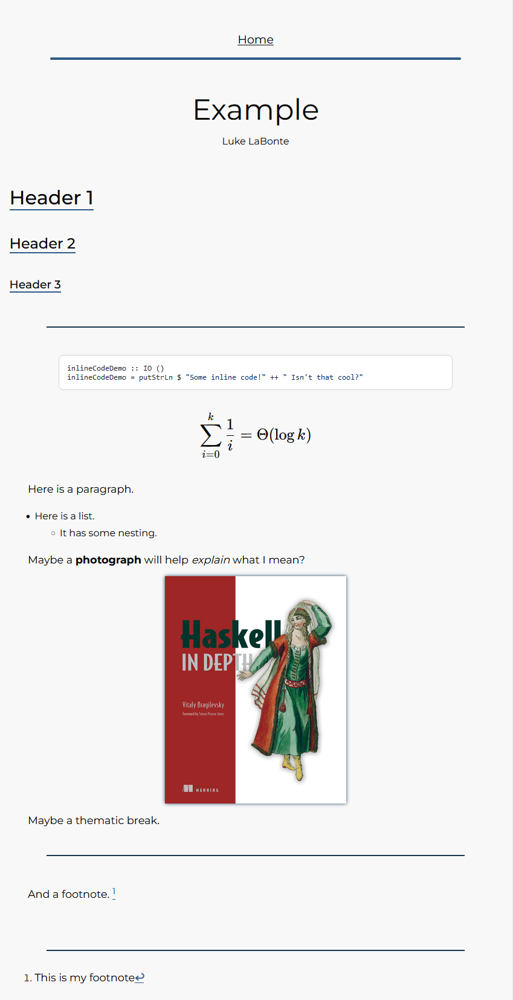

# Verbatim
Verbatim is a simple, fast, static blog generator. It has a number of useful features, 
and is the engine behind my personal blog. 

## Usage 
Verbatim requires `ghc` and `cabal`. To build, simply run `cabal build`, and put the
resulting binary somewhere useful. 

Once invoked, Verbatim will expect to find the file `verbatim.config` in the 
working directory. This file has several options, some of which are mandatory. 
Here is an example `verbatim.config` file.

```
SourceDirectory = ./src
BuildDirectory = ./build
ServerRoute = /
TemplateDirectory = ./templates
AdditionalFiles = ./additional
BlogName = Y/N's Blog
```

Of these, `SourceDirectory`, `BuildDirectory`, `ServerRoute`, and `TemplateDirectory` are mandatory. The options should be fairly self explanatory, 
save for maybe `ServerRoute`. That option specifies the path from the root 
of the server to the directory that your blog is stored in. For example, if 
I stored my blog in a server under `/home/blogs/luke/`, I would specify 
`/home/blogs/luke` in the `ServerRoute` option. Make sure to remember the trailing 
backslash. 

### Directory Structure 
Verbatim maintains the structure of the source directory. Markdown files 
and directories are given HTML files. Directory files contain a list of all of their children. For example, with the file structure 
```
article1.md
topic 1 
    | article2.md
    | article3.md
```
The resulting build directory would be 
```
article1.html
topic 1
    | topic1.html
    | article2.html
    | article3.html
```

where `topic1.html` contains links to `article2.html` and `article3.html`.
Anything that isn't a Markdown file or a directory is simply copied over with 
no transformation.

## Features 
### Templates
Verbatim has a fairly simple, but powerful, templating system. There are three 
built in templates. 
- `Home` 
  - Not required. If given, the root directory will use this, instead of the `Directory` template.
- `Directory`
    - Required. Specifies the layout for directories.
- `Document`
    - Required. Specifies the layout for articles.

Templates are plain HTML files, with other templates optionally nested within. 
For example, if I have the following template, 
```
<!--File Template1.html-->

<h1> This is the header for template 1 </h1>
<!--Template:Template2-->
<h1> All done </h1>
```
and the template 
```
<!--File Template2.html-->

<p> Hello from template 2! </p>
```

then Verbatim will replace `<!--Template:Template2-->` with the content 
from `Template2`. It is important to put all template files in the specified 
template directory, with no nesting. Templates are referred to by their 
file name. For the example above, our directory structure would be as follows. 

```
/template_directory 
    | Template1.html
    | Template2.html
```

The `<!--File...-->` comments are not necessary. They are just there for clarity. 

It is important to remember that template recursion is possible, and Verbatim 
does not protect against this. Error messages are provided in the form of a stack 
overflow.

### Scripting 
Verbatim offers a simple scripting language to help build templates. It is simple 
enough to learn by example, with some sample inputs and outputs.

```
"Hello, world!"; 
" How are you?";

// Hello, world! How are you?
```

Literal values are evaluated and concatenated into the output.

The default object `document` is provided. If the current page is a Markdown file, 
then the field `content` is populated with the rendered Markdown.

```
<!--File Main.md-->

# Hello, world!


<!--Verbatim Script-->
"the content is " ++ document.content ++ ".";

// the content is <h1> Hello, world! </h1>.
```

If the current page is a directory, then the field `elements` is populated 
with a list of objects corresponding with the directory entries. We can loop 
over these elements.
```
// Assume 3 entries with the titles 'A', 'B', and 'C'

for entry : document.entries {
    "<p>" ++ entry.title ++ "</p> ";
}

// <p>A</p> <p>B</p> <p>C</p>
```
For loops evaluate for every element in the collection and concatenate the results.

You may be wondering how to specify the title of a document. This is done with 
a JSON metadata comment. Actually, any field you want can be specified, and 
it will be usable for that specific object. 

```
<!--File MyArticle.md-->
$$$
{
    "title": "Luke's Article",
    "author": Luke,
    "tags": ["fun", "cool", "awesome"]
}
$$$
```

It is **very important** that these comments start and end with `$$$`. Additionally, 
the first `$$$` must be the **first** characters in the file.

Later on, when running Verbatim Script, we can query these properties. 
```
document.title ++ ", " ++ document.author ++ ": ";
for tag : document.tags {
    tag ++ ", ";
}

// Luke's Article, Luke: fun, cool, awesome, 
```

Runtime errors don't (hopefully) exist. If an incorrect identifier is used, 
or a field is queried that does not exist, an empty string will be returned. 
This is helpful in `if` statements, because they operate on 'truthy' values. 
Basically, everything is `true` except for the empty string.

```
if document.entries {
    "This is a directory";
} else {
    "This is not a directory";
}

// Output is dependant on the type of file supplied
```

We can also test things for equality. It is important to remember that equality is 
based on type. A string and a list, or a string and an object, will always 
be not equal. We could do something like this, though.
```
if document.author == "Luke" {
    "<h1> Cool author alert! </h1>";
}
```

The other built-in object is `blog`, which by default contains two entries: 
- `root`:  The `ServerRoute` path specified in `verbatim.config`
- `name`: The name of the blog, optionally specified in `verbatim.config`

Root is helpful for doing things like `<link href='$$blog.root;$$style.css>`.

### Including Verbatim Script in Templates 
So how do we actually use Verbatim Script? We enclose it within two `$$`, like so:
```
<div> Template stuff </div>
<p> Anything can be here </p>
<h1> Author: $$document.author;$$ </h1>
...
```

As of right now, the rules for deciding which `$$` to use are pretty dumb. 
So if you have some `$$` inside a string in your Verbatim Script code, it will break.


### Markdown 
In addition to the regular Markdown features, a number of additional features 
are enabled. 

- Fenced Code Blocks, using `~~~`
- Fenced Code Block Attributes; e.g. `~~~haskell` to specify language 
- Strikeout, using `~~...~~`
- Subscript and superscript, using `~` and `^`
- Tex math
  - Display math between `$$`
  - Inline math between `$`
- Footnotes, with `[^id] ... [^id]: text`
- Inline notes, like `^[Note inside here]`

## Upcoming Features 
Verbatim is still pretty bare bones, and there are some things I would like 
to include. 

#### Very Important, Near Future 
- [x] Templates
- [x] Scripting 
- [ ] File Cache  
- [ ] Smart Recompiling
- [ ] Dev Server

#### Less Important, Distant Future 
- [ ] Upgraded Verbatim Script 
- [ ] Custom Markdown compiler (much faster compiles)
- [ ] Easy build process

## Screenshots 

Here is an example with several common Markdown features. 
The styling is my own -- the user is free to use whatever stylesheet 
they choose. 


